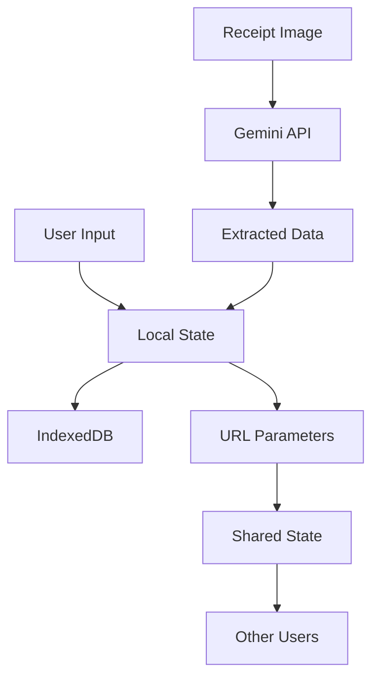
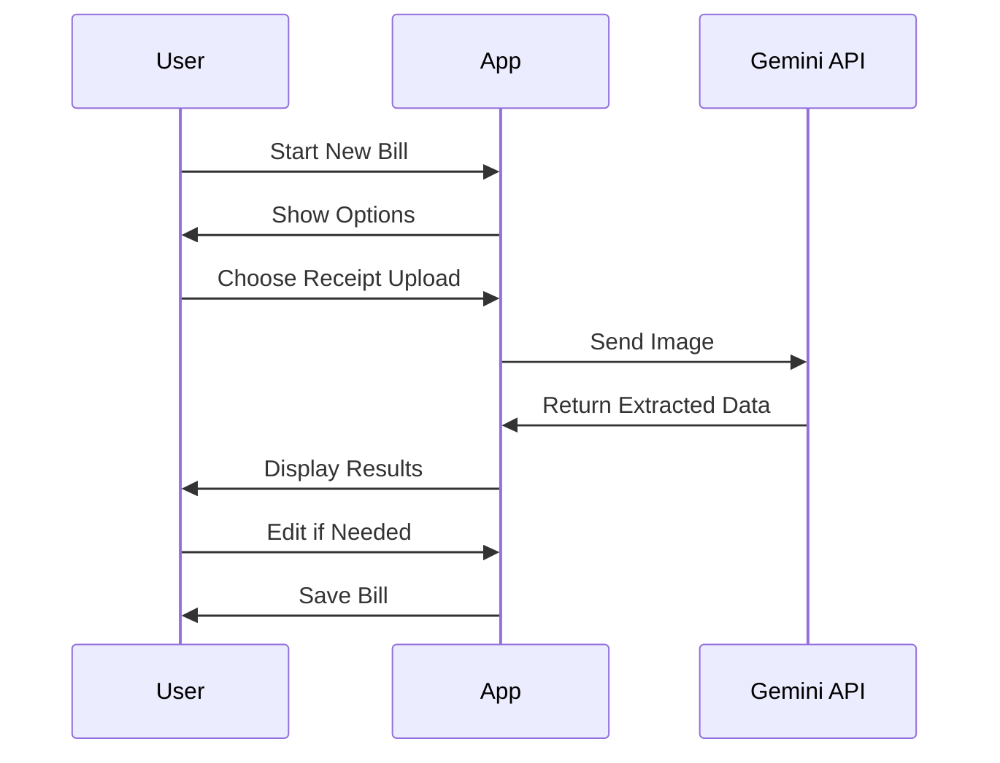
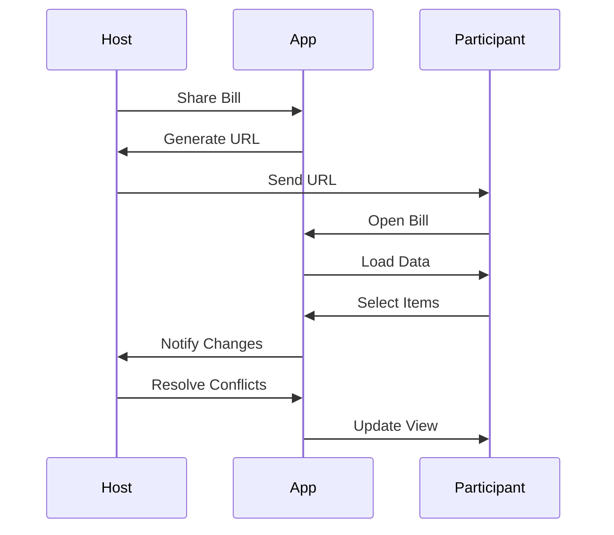
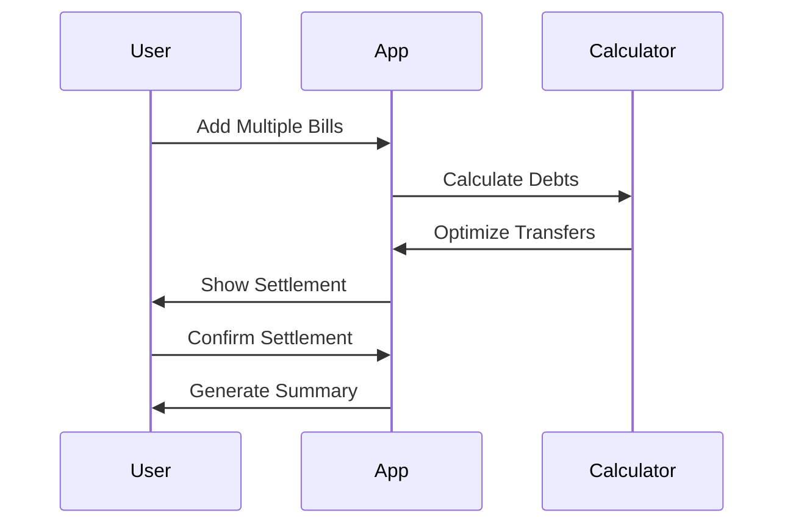

SKIP THIS FILE & DO NOT READ THIS FILE

# Product Requirements Document

## 1. Overview

This is a web application that allows users to split bills with their friends. The application will be a PWA (Progressive Web App) that can be installed on a user's device. The entire application runs client-side with no server requirements, making it free to host on GitHub Pages.

## 2. Features

### 2.1 Receipt Processing
- Scan or upload receipt images
- Extract item details using Google Gemini Vision API:
  - Item names
  - Quantities
  - Individual prices
  - Discounts
  - Service charges
  - Taxes/VAT
  - Total amount
- Manual override capability for all extracted data

### 2.2 Bill Management
- Add/edit/remove items manually
- Adjust quantities and prices
- Add/edit/remove participants
- Assign items to participants
- Support for multiple currencies
- Save bills locally for future reference

### 2.3 Collaborative Features
- Share bill with participants via unique URL
- Participants can select their items independently
- Conflict resolution system for mismatched selections
- Real-time updates when participants make changes
- Offline support with sync when online

### 2.4 Financial Calculations
- Support for various discount types:
  - Percentage-based
  - Fixed amount
  - Per-item or total bill
- Flexible tax and service charge calculations:
  - Service charge before tax
  - Tax before service charge
  - Combined calculation
  - Option to exclude either
- Support for multiple bills and settlements
- Automatic debt cancellation and optimization
- Final settlement calculation with minimum transfers

## 3. Technologies

### 3.1 Frontend
- React.js for UI components
- TypeScript for type safety
- Tailwind CSS for styling
- IndexedDB for local storage
- Workbox for PWA features
- Google Gemini Vision API for receipt processing

### 3.2 State Management
- Redux Toolkit for global state
- Redux Persist for state persistence
- Immer for immutable state updates

### 3.3 Data Sharing
- URL-based state sharing
- Base64 encoding for state parameters
- Local storage for offline data

## 4. Architecture

### 4.1 Application Structure
```
src/
├── components/         # Reusable UI components
├── features/          # Feature-specific components
├── store/            # Redux store configuration
├── services/         # External service integrations
├── utils/            # Helper functions
└── types/            # TypeScript type definitions
```

### 4.2 Data Flow


## 5. User Flows

### 5.1 Creating a New Bill


### 5.2 Sharing and Collaborating


### 5.3 Settlement Process


## 6. Security Considerations

Since the application is fully client-side:
- No sensitive data is stored on servers
- All data is stored locally in the user's browser
- State sharing is done through URL parameters
- No authentication required
- No API keys needed except for Gemini Vision API

## 7. Performance Considerations

- Lazy loading of components
- Image compression before upload
- Efficient state management
- Optimized IndexedDB usage
- Service worker for offline support
- Caching strategies for PWA

## 8. Future Enhancements

- Support for multiple languages
- Dark/light theme
- Export to PDF
- Integration with payment apps
- Receipt history and analytics
- Custom categories for items
